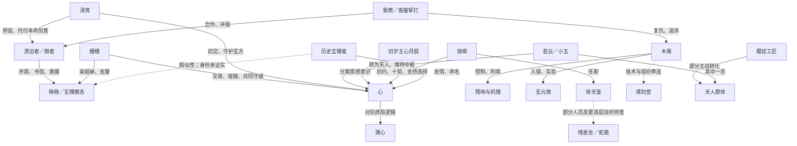

# 鸣潮 3.5–3.7 玄方剧情考据报告

整理日：2026-10-01。完整剧透。阅读入口：[README](README.md)；全部编号、URL、更新时间与缺项：[资料索引](资料索引.md)。

**研究边界：**本报告还原已读的六篇潮汐任务，并用角色和物品文本补充解释。奇谭《璇心如月寄尘情》已开放，但全文尚未收录；因此本文不能代表玄方篇全部剧情的最终结论。危行、纪闻与活动缺项可能修正当前理解。

标记约定：**【事实】**指可见文本直接呈现的行动或说明；**【说法】**指人物作出的判断、承诺或自述；**【推论】**指本文的解释；**【未解】**指证据不足。事实仍受 Wiki 转录准确性这一共同限制。

## 一、全篇概览：城市怎样从工具变成家园

【推论】玄方篇的中心矛盾，是保存文明的技术与具体生命之间的冲突。玄方城起初承担关押和消灭残象的使命，后来真实的人在此生活、劳动、建立关系。原始设计中的“任务结束”于是不能直接等同于居民生活应该结束。木禺把人变成材料，溯心把情感看成秩序偏差；二者不同，但都让技术或规则的目标压过了被它们管理的生命。[S35B](资料索引.md#S35B)·E01/E05，[S36A](资料索引.md#S36A)·E02/E05，[S37A](资料索引.md#S37A)·E04/E07；[C37H](资料索引.md#C37H)·04

故事分三层推进：先救眼前的人，再辨认错误的过去，最后为现实中的未来修改规则。3.5 的胜利并未消除城市内部问题；3.6 杀死木禺也未解决文明之匣的限制；3.7 才将岁主自身的分裂、旧约和城的终局推到前台。[S35B](资料索引.md#S35B)·E06，[S36M](资料索引.md#S36M)·E02，[S37A](资料索引.md#S37A)·E01/E07

### 3.5：山雨、攻城与秧秧的选择

【事实】秧秧与炽霞调查从今州前往梦州后失踪的人，进入必经的玄方地界。炽霞负伤返回，秧秧留下；漂泊者在返抵今州后才逐步知道这一局面。今汐需要维持今州防务，外州兵力介入又涉及权属，因此由漂泊者前往，穗穗同行。不能把开篇的往返信件直接写成漂泊者已经收到求救信。[S35A](资料索引.md#S35A)·E01/E02

【事实】机傀异常、通信受扰、山门封闭使局部调查扩大成救援。椋羽在例行行动中失去杜仲、青枳等同伴，又受到秧秧帮助。秧秧在衔翎村和咎庭照顾受困者、倾听残响，并将保护孩子和疏散民众放在追敌之前。青彦的复仇冲动也被引向照顾青黛。颜朗与明煜等人的牺牲，使“救人”始终有无法撤销的代价。[S35A](资料索引.md#S35A)·E03/E04；[I19](资料索引.md#I19)

【事实】木禺借天工身份接近秧秧，把她引到悬天构。他修改死者残响的认知、改变仇恨的对象，再将其置入机关核心。困在设施中的活人也成为实验对象。异常不是死者天然仇视生者，更不能把所有残响都写成自愿投敌。[S35A](资料索引.md#S35A)·E05，[S35B](资料索引.md#S35B)·E01/E05

【事实】穗穗另行接触鬼猫挈灯和琢钧堂的渠道，为获得宿镜与心交易。漂泊者得到岁主权能，打破屏障；秧秧面对受扭曲的残响，恢复其频率并产生新的能力。守城依靠多方行动：定玄卫、椋羽、清宵、穗穗和漂泊者各自承担一部分。[S35B](资料索引.md#S35B)·E02/E04/E05

【推论】秧秧的变化不只是战斗强度提升。她从想靠近英雄，走向能够承受他人痛苦、帮助别人作出选择的人。她并未换掉自己的家庭、友谊或过去；幕间仍明确保留她作为穗穗妹妹的身份，成人海螺也是父母托送的礼物。[S35M](资料索引.md#S35M)·E01；[C35Y](资料索引.md#C35Y)·04/05/P

**版本新增：**玄翎雀与梁鸢的传信传统、两百年前的战争、木禺的实验与岁主失联。**尚未解决：**木禺真身、岁主所在、秧秧能力变化的底层原因。秧秧检验曲线没有支持一次常规的新突变，医生给出的“补全”类比仍是解释假说。[S35M](资料索引.md#S35M)·E02；[C35Y](资料索引.md#C35Y)·R

### 3.6：完美历史的牢笼与清宵的心剑

【事实】穗穗回梦州调查琢钧堂和边庭；秧秧留在地界参加巡逻。新的异常表现与此前攻城并不相同：机傀停摆、雾发生变化。清宵以琴音分布剑意守护地界，凡人的守护意愿能参与其中，而她本人承担持续消耗。[S36A](资料索引.md#S36A)·E01

【事实】景燃以寿命为代价进入蜃境，长期潜入木禺一方。他的目的包含复仇，也包含保护被当作消耗物的残响。玄元境呈现保存完整的渊城、似乎能够赢下的战争以及所谓仙人秩序，但这是控制中枢中的历史数据与模拟，被木禺改造后能影响现实；不是众人真的穿越到另一段历史。[S36A](资料索引.md#S36A)·E02/E04；[G04](资料索引.md#G04)

【事实】若云以“小玉”的机傀载体活动。她曾在渊城战场自爆，后来由心保存频率；成为天人是她在知情后作出的选择。天境工匠受到认知切除等控制，与有自主记忆的地境残响形成区别。不能把所有机傀、残响、天人统一写成同一种“复活者”。[S36A](资料索引.md#S36A)·E04

【事实】清宵的内景重现自己救不了所有人的困境。试图改写一次次结果仍不能消除损失；她最终承认有限性，重新接纳心魔所承载的情感。漂泊者保管本命剑意并提供支持。这条路径与简单斩掉心魔不同，也不等同于认同不救人。[S36A](资料索引.md#S36A)·E03；[C36Q](资料索引.md#C36Q)·03/05；[G05](资料索引.md#G05)/[G08](资料索引.md#G08)

【事实】木禺兵解后成为天傀劫煞，吞取残响；清宵阻止灵魂继续被利用。景燃驾驶云梭参与战斗，心最终介入。木禺的“道只是败给更强者”属于他的自我辩护。幕间又说明主线终局没有彻底消灭其意识残余，景燃拒绝他的交易，完成追杀。[S36A](资料索引.md#S36A)·E05，[S36M](资料索引.md#S36M)·E02

**版本修正：**机傀之乱背后不只是机关被污染，还涉及数据空间、天人和机关术的权力结构。心失联并非纯粹袖手旁观，她受到中枢限制。琢钧堂公开切割木禺不等于组织整体毫无牵连；花间傀和残星会技术交易仍需调查。[S36A](资料索引.md#S36A)·E06

**新的接续：**吟霖追查渐水舵，锁暝与她联系；景燃父母死于十多年前的刃偶失控事件，不能把这件事并入两百年前的云渊之役。[S36M](资料索引.md#S36M)·E01/E03

### 3.7：旧岁主、分形与保留城市的代价

【事实】朝月会前传出玄方城将崩毁的消息。谛天鉴人员监测岁主频率，锁暝来到玄方寻找心月狐。她承认推动过传言，同时强调城市居民及神宫与城市运作的关系。棠宁的顾虑和她的态度说明谛天鉴内部不能一概归为同一阵营。[S37A](资料索引.md#S37A)·E01；[G26](资料索引.md#G26)

【事实】梦枢天罗是更完整的控制中枢。天人分担运行工作，心则在有限资源下保留他们的感情和自我。心域同时承载记忆、情绪和数据呈现；看见的往昔场景需要辨别是历史再现、角色回忆还是试探。怡心域中的旧友并非都真的重生。[S37A](资料索引.md#S37A)·E02/E06；[C37H](资料索引.md#C37H)·03

【事实】旧心月狐在匣受损、岁主共鸣者死亡等变故后分离情感意识，形成如今的心。残星会对匣的侵蚀早于当前攻城。旧岁主选择稷廷的一项考量，是把危险的求知执念约束在玄方的建造使命中；这比“稷廷技术好，所以击败琢钧堂”更复杂。来自谛天鉴内部的蛇菰与残星会勾连，又使行政与技术问题相连。[S37A](资料索引.md#S37A)·E03

【事实】建城并非岁主瞬间变出完整体系。归字枢起初只是原型，人的数理和工艺帮助它扩展；心分出算核、分配资源，也承担权能的削减。玄翎雀成为她的朋友并给予“心”这个名字。这些相处属于分离后的经历，是心成为独立主体的重要依据。[S37A](资料索引.md#S37A)·E04；[C37H](资料索引.md#C37H)·02/P

【事实】云渊之役的渊城战场中，军民争取归字枢与撤离的时间；卫长、若云、玄翎雀以及稷廷工匠各有选择。稷廷工匠主动成为天人以维持中枢，并不消除后来的束缚与损耗。心的自责是真实情感，却不能直接证明她应对全部死亡负责。[S37A](资料索引.md#S37A)·E05

【事实】溯心代表底层矫正逻辑与恢复旧秩序的要求。心尝试保留城的未来，触及自毁人格的危险；重新恢复旧模型也不能完整取回此前丢失的情感。玄朱锁保存的最后频率支持心按自己的本心选择。锁暝则拒绝怡心域中以旧岁主外貌要求她舍弃情感的试探，禁锁与同伴的遗志帮助她支持心。[S37A](资料索引.md#S37A)·E06/E07

【事实】终局保住城市，许多意志将耗尽的天人暂入宿镜，少数仍留下清理中枢；不是天人全体立即获得永久新家。心继续承担岁主职分，但身份公开受到梦州局势约束。更高层的隐瞒、蛇菰余线与稷字讯息没有全部解释。[S37A](资料索引.md#S37A)·E08

奇谭已经开放，官方给出的接取主题是帮助一位身份未明的少女收集情匣碎片。本报告没有用攻略猜测补写少女身份与故事结局。[O37](资料索引.md#O37)；[D01](资料索引.md#D01)

## 二、双时间线

### 实际发生顺序

绝对年代不足时仅记录相对位置；“约两百年前”不转换成公元年份。心月狐经历、华亭十契、渊城战争之间未明示的先后不强行排定。

| 相对时间 | 事件 | 呈现性质与证据 |
|---|---|---|
| 玄方城建造前，年代未定 | 文明之匣已有梦州文明的底层资料；残星会侵蚀、岁主共鸣者死亡等变故发生 | 心的往事说明与心域再现，S37A·E03；不能把全部原因缩成一个事件 |
| 建城议事及其后 | 心月狐选择稷廷；遭刺杀；情感意识分离为心 | S37A·E03，C37H·02；分离细节仍有记忆缺损 |
| 建城推进期间 | 原型归字枢扩大，心与工匠合作，与玄翎雀成为朋友 | S37A·E04 |
| 约两百年前的云渊之役 | 云陵谷、渊城两处战场；若云、卫长、玄翎雀等牺牲，工匠转为天人 | S36A·E03/E04，S37A·E05，G16；模拟中的云梭胜利排除 |
| 战后数年及后续建城阶段 | 居民逐渐定居；心开始反对城市完成使命后销毁的终局 | C37H·04；由档案补足，不能写为3.7才萌生 |
| 战后延续至今 | 清宵守护地界；机关维护、定期清剿与城中生活延续 | C36Q·01/02，G19–G25 |
| 与上述历史先后未定 | 华亭恶瘴、十契反抗与伙伴牺牲，锁暝接受州监职分 | S37A·E06；尚缺故梦寻契和完整锁暝档案 |
| 十多年前 | 景燃父母死于刃偶失控；三刀、烟舒收留他 | S36M·E01，C36J·02 |
| 景燃少年及后来 | 十五岁成为寻幽客；师父在蜃境舍命救他；长期调查、潜入木禺势力 | C36J·01–04，S36A·E04；各段不能凭年龄补成年份 |
| 当前危机前数日 | 椋羽小队遭机傀袭击；秧秧与炽霞调查失踪人口并进入玄方 | S35A·E01/E03；“三日前”“两日前”各按说话场景理解 |
| 3.5 当下 | 疏散、悬天构营救、机傀攻城、秧秧能力变化 | S35A/S35B |
| 3.5 战后两天等相对时间 | 华胥检验、成人礼、海螺引起异象 | S35M |
| 3.6 当下 | 玄元境调查、内景、天傀劫煞之战 | S36A |
| 3.6 战后 | 景燃杀死逃逸残余；吟霖和锁暝相接 | S36M |
| 3.7 朝月会前后 | 进入梦枢天罗，恢复往事，解除终局危机，暂安置天人 | S37A |

### 玩家获知顺序

| 阅读阶段 | 当时的理解 | 后来的补充或修正 |
|---|---|---|
| 3.5 前半 | 失踪与机傀失控是眼前案件；岁主无法联系 | 3.6、3.7 显示中枢、权限及岁主分裂问题 |
| 3.5 后半 | 木禺操纵残响；秧秧与玄翎意象相连 | 3.7 呈现真实的玄翎雀及其与心的关系，但仍未证明秧秧的同一身份 |
| 3.5 幕间 | 能力变化无法用常规检验说明；神秘声音提出巡礼 | 后续只部分补充；匿名声音和被遮蔽内容仍未解 |
| 3.6 玄元境 | 战争似乎被改写，渊城完好 | 这是被木禺控制的模拟，不能取代真实历史 |
| 3.6 内景 | 清宵无法摆脱过去的失败 | 接纳心魔与有限性，让修行不再以剥离情感为唯一道路 |
| 3.6 战后幕间 | 木禺仍有残余；景燃复仇的具体缘由出现 | 主线战斗结果不等于其意识当场彻底灭亡 |
| 3.7 心域 | 心月狐、心及底层逻辑的区别，建城与战争细节被逐层说明 | 旧设定被重新解释，但回忆、模型和主体仍不能混同 |
| 角色档案交叉阅读 | 战后数年已出现终局冲突；人物有日常与早期选择 | 档案发布时间不能充当事件发生时间 |
| 奇谭及活动 | 尚缺全文 | 暂停对此部分下最终判断 |

## 三、人物与关系

### 关系图

实线为已读文本中的关系；虚线为角色猜测或未完成调查。这里的“源出”不表示两个主体始终相同。

天人群体有多位工匠，若云只是其中一员。谛天鉴—残星会虚线只指已揭露的部分人物和待查联系；不指整个机构均为残星会。[S36A](资料索引.md#S36A)、[S36M](资料索引.md#S36M)、[S37A](资料索引.md#S37A)

### 秧秧／玄翎：成长先于身份谜题

**结论【推论】：**新模态首先完成的是主动承担守护责任的成长，而“她到底是不是历史玄翎”仍应悬置。

**依据：**她在能力改变前已救助村民、参与疏散；能力改变后仍承认自己是原来的秧秧。档案记述早年苦练、途中救人后面对暴力的低落，以及对漂泊者具体而个人的关心。珍贵之物中的“壳”解释了她封存旧帽子、发带的自主决定。[S35A](资料索引.md#S35A)·E04，[S35B](资料索引.md#S35B)·E05，[S35M](资料索引.md#S35M)·E01；[C35Y](资料索引.md#C35Y)·01/02/05/P

**推理：**新能力有神秘来源，却不是凭空赋予她道德意志。她的经历已经使她作出选择；外貌与力量变化再将选择显形。

**边界：**清宵说她像玄翎，是角色感受；华胥医师提出的补全类比，是模型解释。两者都不足以证明转世、附身或同一灵魂。祀声之人与匿名声音之间也还缺身份链。[C36Q](资料索引.md#C36Q)·V；[C35Y](资料索引.md#C35Y)·R；[S35M](资料索引.md#S35M)·E03

### 穗穗：把情感变成可执行的支援

**结论【推论】：**穗穗的商贸手段服务于流通和生活，而不只是为妹妹担忧或逐利。

**依据：**她交易宿镜、联络渠道、提供物资，在3.6返回梦州继续调查。故事中的灾后物资与水路筹算，语音中的长久流通理想，解释了这些选择。[S35B](资料索引.md#S35B)·E02/E04，[S36A](资料索引.md#S36A)·E01；[C35S](资料索引.md#C35S)·02/04/V

**推理：**她与心相互理解的基础，是珍惜人间生活。她愿意下注漂泊者这个变量，但不是否认风险，而是认为封闭的预定结局可以改变。

**边界：**商会渠道、琢钧堂的援助与木禺的责任必须分开。合作不证明她认可所有技术或政治行为。页面、主线中理事长等称谓须保持原文语境，不凭称谓差异补写晋升。

### 清宵：剑心不以无情为完成

**结论【推论】：**清宵的成长是改变承担痛苦的方式，不是从不关心人变成关心人。

**依据：**她长期照看玄方、教导椋羽、帮助商队；云渊之后的质问显示她始终在意损失。静微心魔的旧事让她原有斩心魔路径有历史根据；当前内景则使她接纳自己的情感。[C36Q](资料索引.md#C36Q)·01–03/05/V；[S36A](资料索引.md#S36A)·E01/E03

**推理：**她不是放弃责任，而是拒绝用“必须救下所有人”衡量每次救援。让凡人自己的守护意愿参与剑阵，也使保护不只依赖一个仙人。

**边界：**静微仍是有教导、玩笑与情感的师父，不能只当冷酷道统的代言人。清宵双角与瑞兽的关联是报告猜测，不能推出神兽血统；与御者的久远联系也不宜把匿名教剑者强行指认为某个已知角色。[C36Q](资料索引.md#C36Q)·R/03/04/V

### 景燃：复仇之外仍有生活

**结论【推论】：**景燃以复仇推动行动，但作品保留了他与家人、师门、读者及伙伴的关系，避免把他写成只剩仇恨的工具。

**依据：**主线中他保护来福等残响，幕间拒绝木禺以技术和文明之匣换命；故事、账簿与手稿中又有给师母寄钱、照顾师妹、写书、逛市集等日常。[S36A](资料索引.md#S36A)·E04，[S36M](资料索引.md#S36M)·E01/E02；[C36J](资料索引.md#C36J)·01–05/P

**推理：**对木禺来说，别人的死是可遗忘的实验代价；对景燃来说，记住具体姓名就是复仇和写作的共同基础。报仇后继续追查组织，也显示个人仇账不等于系统责任已清。

**边界：**命灯与山猫持续消耗寿命，他主动趋近危险；不能把眼部损伤当普通眼疾，也不能仅凭猫的交易给出精确剩余寿数。书中奇闻含艺术加工，不能逐条作为世界观事实。[C36J](资料索引.md#C36J)·R/P/V；[S36M](资料索引.md#S36M)·E01

### 若云：选择并不消除束缚

【事实】若云是稷廷工匠、战场牺牲者，也是在心保存频率后选择成为天人的主体。“小玉”是她使用的机傀载体，不能当另一位毫无关联的角色。[S36A](资料索引.md#S36A)·E04

【推论】她既证明死后的持续存在能保留人的愿望，也暴露了这种保存依赖权限、空间与资源的限制。清宵关于她名字和自由愿望的语音，令技术上的保存与自由之间的落差更具体。[C36Q](资料索引.md#C36Q)·V

【边界】她的知情选择不能代表每个残响都同意被利用；木禺控制工匠与心保存天人应逐项区别。

### 心、心月狐、溯心：记忆继承与独立主体

**结论【事实＋推论】：**心源出旧岁主，但分离后的经验与情感使她不只是等待归一的副本；这是剧情反对抹除她的重要基础。

**依据：**《何以为心》区分继承的过往与亲身走过的经历；建城、玄翎友谊、保存居民生活构成她自己的历史。主线最终让她沿自己的选择继续岁主责任。[C37H](资料索引.md#C37H)·02/04；[S37A](资料索引.md#S37A)·E03/E04/E07

**推理：**拥有来源相同的记忆不等于始终作同一选择。溯心回到旧模型的主张，尤其不能替代心作为主体的愿望。

**边界：**心对于“我害死祂”的判断首先是自责。匣的反哺、旧频率消失和多次损耗共同构成线索，但旧岁主消失的完整因果仍不足以被简化成“心谋杀本体”。天罗狐影、心狐分形与溯心的功能也不能仅因狐形相似就混为一人。[S37A](资料索引.md#S37A)·E02/E07

**图鉴补证：**天演溯心的敌人描述明确其原职是确保玄方城按期崩毁；心尝试覆写引起反制，它从匣底层攫取数据而形成近似岁主的外貌。解形煞、绝息魄则是它夺取心部分权限后仿照心傀制造的战斗机关，攻击天人并阻碍修复。因而溯心有具体夺权与破坏行为，不能只当心的内心想象或一个无行动的抽象规则。[EN03](资料索引.md#EN03)/[EN04](资料索引.md#EN04)/[EN06](资料索引.md#EN06)

### 锁暝：契约保留的是人的选择

【事实】锁暝具有州监身份和禁锁十契，伙伴的意志与华亭恶瘴经历构成她的行动背景。她在怡心域识破旧友再现与假岁主试探，并以契约支持心。[S37A](资料索引.md#S37A)·E06，[C37L](资料索引.md#C37L)

【推论】她与清宵同样反对以消除情感来证明责任。十契并不只是力量库，也承载已经无法回来者的意志。

【边界】谛天鉴身份不等于无条件服从所有上级。基础报告的契约成立条件不能省略；完整档案和《故梦寻契》仍未收齐，十位伙伴的逐人经历、契序和能力不能自行补全。

### 木禺：用胜负替代正当性

【事实】他操纵残响、控制工匠、实验活人，失败后又以数据交易性命。[S35B](资料索引.md#S35B)·E01/E05，[S36A](资料索引.md#S36A)·E02/E05，[S36M](资料索引.md#S36M)·E02

【推论】他称自己只是力量不足，等于把伦理问题转化为技术成败。玄方篇的反驳来自被利用者仍有记忆、关系与自主愿望，而不是主角单纯拥有更强武器。

【边界】木禺与琢钧堂存在历史和技术联系，但不能用他个人的每项罪行替代对全组织的调查；公开切割也不能证明组织已洗清责任。[S36A](资料索引.md#S36A)·E06

## 四、世界观与机制

### 空间、数据与载体

| 名词 | 已证实的基本功能 | 易混点与边界 | 依据 |
|---|---|---|---|
| 文明之匣 | 保存岁主与文明的底层数据；关联中枢运作 | 不是万能备份；受损、侵蚀、权限与人格丢失均影响结果 | G06，S37A·E03/E07 |
| 归字枢 | 建城中枢原型及后来扩展的关键机制 | 人的数理、机关工艺参与扩展，非完整体系凭空出现 | S37A·E04/E05 |
| 梦枢天罗／万相神宫 | 玄方控制中枢，呈现多个心域 | 心域的不同呈现不能全部当客观历史现场 | S37A·E02，O37 |
| 玄元境 | 中枢内存储历史数据的空间，有人、地、天等层级 | 木禺模拟的完美渊城不是真实过去；是匣的一部分而非匣的全部 | G04，S36A·E02/E06 |
| 内景 | 修行者入定中的心象世界 | 清宵的失败循环是内心困境，不能给现实年代排序 | G05，S36A·E03 |
| 蜃境 | 文化中的各类亦真亦假幻境总称 | 名称相同不证明所有空间机制相同 | G30 |
| 天人 | 被保存频率、参与中枢工作的稷廷工匠等 | 有自我与感情；载体、自由和寿续有约束；不等于全部机傀 | S36A·E04，S37A·E02/E08 |
| 活字机关 | 机关运行与频率、数据、控制相关的重要载体 | 木禺脱逃后的活字线索与天人不能直接等同；完整术式缺材料 | S36A/S36M |
| 分形 | 岁主的意识、感知与信息可分出实体，源头与分形可互联 | 离源经历变化后联系可截断；独立性不能被外貌抹平 | C37H·R，S37A·E03 |
| 宿镜 | 心月狐以自身频率制作、封存部分权能的信物 | 有御者权限及安置频率等用途；不是无代价永久复活装置 | G10，S35B·E02，S37A·E08 |
| 玄朱锁 | 保存旧约与最后频率的信物，支持辨认与选择 | 不是普遍测谎仪；相关禁锁响动有特定触发条件 | S37A·E01/E07 |

【推论】作品同时使用修行、神话和数据术语。合理的整理方式是先记录它们在场景中实际做了什么，再谈关联；不因为同属“频率”就把心魔、残响、天人、分形与机关核心视为一种无差别物质。

### 技术、行政与组织

| 组织／职务 | 关系与行动 | 不能推出的结论 |
|---|---|---|
| 谛天鉴 | 观测岁主、天文历法，在岁主事务上有特殊监察权；州监与监正有层级区别 | 不是对各州行政拥有无限直接统治权；部分勾连不等于全员残星会 [G26](资料索引.md#G26)，[S37A](资料索引.md#S37A) |
| 稷廷 | 参与归字枢、玄方建造；部分工匠在战后成为天人 | 工匠牺牲不自动洗清组织过去的研究风险，也不能把若云等失踪者一概当死于组织迫害 [S36A](资料索引.md#S36A)，[S37A](资料索引.md#S37A) |
| 琢钧堂 | 曾与天工部合建渊城；与玄方建造方案、木禺、分舵及花间傀线索有关 | 不因未获选就默认一切报复均由组织统一命令；仍需调查具体责任 [G17](资料索引.md#G17)/[G09](资料索引.md#G09)，[S36A](资料索引.md#S36A)·E06，[S37A](资料索引.md#S37A)·E03 |
| 残星会 | 文明之匣侵蚀、蛇菰与技术交易等线索连接当前案件 | 尚无材料支持它控制所有梦州机关与所有失控事件 [S36A](资料索引.md#S36A)·E05/E06，[S37A](资料索引.md#S37A)·E03/E08 |
| 军策府、定玄卫、后玄三骑 | 地界日常清剿与防务；后玄三骑为处理特殊问题的三人小队 | “后玄骑使”不是与后玄三骑无关的新军种 [G20](资料索引.md#G20)/[G22](资料索引.md#G22)/[G23](资料索引.md#G23)/[G28](资料索引.md#G28) |
| 外事府 | 监运使管理物资，巡方使核身份并兼管治安 | 不能仅凭掌握信息就断定其整体参与绑架 [G21](资料索引.md#G21)，[S35A](资料索引.md#S35A) |

### 三种“保存”及其伦理差异

【事实】木禺修改残响认知，使其替自己攻击；心保存天人的情感与自我，且若云的选择有知情过程；心将濒于耗尽的天人收入宿镜则是危机后的暂时安置。[S35B](资料索引.md#S35B)·E05，[S36A](资料索引.md#S36A)·E04，[S37A](资料索引.md#S37A)·E02/E08

【推论】三者技术上都可能涉及频率延续，伦理上却应分别询问：是否知情同意、能否保持自身目标、是否可以离开、谁承担维持成本。只问“有没有留下频率”会掩盖故事真正的争议。

### 城市运维与普通居民的生活材料

【事实】玉冥蛇负责将咎庭遗留声骸运往神宫，也定期搬运残响，经无害化后投入深渊。奇绽傀原本伪装成花坛对付残象，后来因溯心扰乱秩序而异化。这补出了日常运维与当下破坏的区别；并非所有残响处理和机关攻击都由木禺发明。[EN01](资料索引.md#EN01)/[EN02](资料索引.md#EN02)

【事实】巡宵枪卫图鉴的正文称“巡霄枪卫”，记述稷廷为支援咎庭和应付空中残象研发的新机傀；外形参考玄翎雀，动力与巡霄环同源，产线未及量产便遭战争破坏。此处叙述真实历史中的未完成技术，与玄元境里已经完善的理想战史形成可供对照的线索。[EN05](资料索引.md#EN05)，[S36A](资料索引.md#S36A)·E02

【推论】取自玄翎雀外形的并非只有通信机关，军事机关也有相同灵鸟意象。形式相似既可能承载纪念，也可能服务不同实际用途；不能把所有鸟形机关都视为同一只玄翎的延续。

地方材料又让“文明”有了生活尺度：六合瑛说明工厂选址与能量传导的关系，洄音石连接地方音乐与动物，未琢玉承载保护鸟卵和祝福孩子的习俗。倾念华中的神狐散力、月灯邀狐与花随情绪变化，则明确以传说方式记录，不能直接并入分形的科学机制。[MT07](资料索引.md#MT07)/[MT09](资料索引.md#MT09)/[MT11](资料索引.md#MT11)/[MT02](资料索引.md#MT02)

## 五、跨文本考据

| 补充材料 | 补足了什么 | 对主线初读的影响与限制 |
|---|---|---|
| 秧秧五篇记录、壳与世界之声 | 从军前的不足、救人后对暴力的困惑、友谊与具体情感；海螺再连神秘声音 | 成长不从新能力才开始；被遮蔽字词仍不可补全 [C35Y](资料索引.md#C35Y) |
| 穗穗四季故事、姊妹笺与语音 | 商贸、救灾、故乡家庭和太平愿景 | 宿镜交易不只是姐妹救援；“数十载以前”语音措辞与年龄关系待核，不能自行定出生年代 [C35S](资料索引.md#C35S) |
| 清宵云渊之后、斩心魔、道是无情却有情 | 战后自责、静微旧事、当前接纳的延续 | 她一直关心人；师父的道路有情境，不宜扁平化为绝对无情 [C36Q](资料索引.md#C36Q) |
| 景燃手稿、账簿、少年与师门故事 | 写作和复仇以外的关系；师父亡故的背景 | “鬼猫挈灯”同时是作者身份；书中加工内容需降为叙述文本 [C36J](资料索引.md#C36J) |
| 心《留此城春》与《何以为心》 | 终局冲突早在战后建城阶段出现；来源记忆与独立经验有区别 | 3.7的选择是长期冲突的显现，而非临时产生的爱民念头 [C37H](资料索引.md#C37H) |
| 心“第一只梁鸢” | 第一只由心制作并寄存挚友最后频率，后来工匠仿制 | 群体传信技术与一个具体友人的纪念相连；不是每只梁鸢都等于同一生命 [C37H](资料索引.md#C37H)·P，[G18](资料索引.md#G18) |
| 《机傀检修报告》 | 远志此前曾报告路线异常，却被解释为轻微传感问题 | 危机有被日常流程错过的预警；不证明检修人员故意同谋 [M03](资料索引.md#M03) |
| 衔翎村日记 | 学琴、杜仲、村中生活与共鸣觉醒 | 与椋羽经历有多处对应，但无署名，仅能作作者身份推测 [M01](资料索引.md#M01) |
| 贴在墙上的告示 | 外事府要求巡霄异常时立即疏散 | 体现制度性应急安排，不能只把守城归于个人英勇 [M02](资料索引.md#M02) |
| “故人如昨”照片 | 颜朗、明煜等作为日常中的人留下影像 | 将战死者重新放回生活关系；相关纪闻全文未读 [I19](资料索引.md#I19) |
| 包裹与阵亡清单 | 儿童玩具、信件、旧戏票等承载无法按时完成的递送 | 可支持战争影响私人生活，收件人与事件完整因果须等《归期未有期》 [I20](资料索引.md#I20)/[I21](资料索引.md#I21) |
| 丹瑾主题照片与药品 | 危行、定玄之外其一的奖励与任务线索 | 只作为任务存在及主题提示，不替代危行、纪闻剧情全文 [I18](资料索引.md#I18)/[I23](资料索引.md#I23)/[I24](资料索引.md#I24) |
| 五件武器文案 | 远志、入尘、旧梦、无情机枢因眷恋留下岁月等意象 | 是主题旁证，不据短诗增设人物身份或确定历史年份 [W01](资料索引.md#W01)–[W05](资料索引.md#W05) |
| 九个机偶兵团玩具条目 | 机关形态进入儿童游戏和生活叙事 | 甲大王的玩具说明不宜当正式军制；系列尚有未采部件 [I01](资料索引.md#I01)–[I09](资料索引.md#I09) |
| 解形煞、绝息魄与天演溯心图鉴 | 夺取权限、仿造心傀、主动攻击修匣天人 | 加强对“底层逻辑如何成为行动者”的解释；近似岁主外貌不等于旧岁主真实归来 [EN03](资料索引.md#EN03)/[EN04](资料索引.md#EN04)/[EN06](资料索引.md#EN06) |
| 清尘念·浮声与云岚疏影 | 数百年琴胚留给知音、为朝月会准备但未使用的冠饰 | 清宵有主动寻求人间交往的愿望；并非只有冷淡仙人外壳 [SP06](资料索引.md#SP06)/[SP08](资料索引.md#SP08) |
| 何处梦清辉与承春 | 心为私人喜好犹疑、御者支持；珍爱匠人首作的稚拙 | 不仅宏大牺牲，自我愿望也受到肯定 [SP03](资料索引.md#SP03)/[SP05](资料索引.md#SP05) |
| 枕霞间与云中雀 | 母亲缝的姊妹鸟玩偶、秧秧按新模样重缝 | 家庭关系与自我更新并行，辅助反对“获得能力便取代旧自我”的解读 [SP09](资料索引.md#SP09)/[SP10](资料索引.md#SP10) |
| 无主的梁鸢 | 百年前未送出的消息，交给秋鸿或鸱吻帮助规划城市未来 | 收集玩法本身连接历史与治理；逐条消息全文尚缺 [MT04](资料索引.md#MT04) |

独立 NPC、3.5多数声骸背景、探索报告和限时活动对白尚未完成横向比对。因此“支线没有改变主线”或“所有物品都支持同一解读”都超出当前证据。

## 六、主题与叙事评价

### 传承：保留选择，而不只是保留形状

【推论】玄翎雀—梁鸢的关系展示了形式可以被复制、情感可以继续传递；心的独立经历又展示继承不能抹去新主体。秧秧的新模态、景燃的手稿和清宵的剑意都让传承成为可以由后来者继续作出选择的关系。[G15](资料索引.md#G15)/[G18](资料索引.md#G18)；[C37H](资料索引.md#C37H)·02/P；[S35B](资料索引.md#S35B)·E05；[C36J](资料索引.md#C36J)·P；[S36A](资料索引.md#S36A)·E03

**解释边界：**主题相似不能反推同一身份，也不能证明所有频率保存都成功复制了原来的人。

### 情感与秩序：规则曾经合理，仍可能需要改变

【事实】城的原始使命有实际防灾背景，先进技术的禁制也有防止误用的理由。心的档案并未否定一切约束，而是指出当居民在这里拥有真实生活后，原终局不再覆盖新情况。[C37H](资料索引.md#C37H)·04；[S37A](资料索引.md#S37A)·E04/E07

【推论】3.7更有力的矛盾不是“规则坏，感情好”，而是目标与条件已经变化，系统仍要求照旧执行。溯心的机械坚持与木禺的技术狂热在此形成对照：前者冻结过去，后者不顾他人推进自己的未来。

### 牺牲与责任：无所不能的要求怎样伤人

【事实】疏散仍有人死亡；清宵在内景试尽选择仍不能救全；心在战争中也不能兼顾一切。[S35A](资料索引.md#S35A)·E04，[S36A](资料索引.md#S36A)·E03，[S37A](资料索引.md#S37A)·E05

【推论】三段不是否认牺牲，而是拒绝让幸存者只能用终身自责回应牺牲。共享责任、记住名字、继续建设比自我消除更接近作品给出的答案。景燃拒绝交易则保留另一个侧面：接受有限性不意味着免除加害者的责任。[S36M](资料索引.md#S36M)·E02

### 叙事的优点

- **信息递进有效：**3.5的失联、3.6的中枢限制、3.7的分形与旧约，逐步改变同一现象的解释，而不是每章另起孤立案件。[S35B](资料索引.md#S35B)·E02，[S36A](资料索引.md#S36A)·E06，[S37A](资料索引.md#S37A)·E03/E07
- **日常有实质作用：**书信、点心、照片、琴声、账簿让“文明”具体成可以继续的生活，而非仅供宣讲的抽象价值。[C35Y](资料索引.md#C35Y)·P，[C36J](资料索引.md#C36J)·P，[I19](资料索引.md#I19)，[C37H](资料索引.md#C37H)·05
- **模拟承担论证：**玄元境的完美战史揭露被操纵的幸福；内景失败让清宵改变承担痛苦的方式；怡心域让锁暝面对自己的遗志。三个空间分别检验不同选择。[S36A](资料索引.md#S36A)·E02/E03，[S37A](资料索引.md#S37A)·E06

### 疑点与需要进一步核验的地方

- **层级较多，解释负担重：**文明之匣、玄元境、梦枢天罗、心域、分形与溯心的联系需要多次转场才能明确；应补实机演出核对，避免将对白中的比喻当严格系统定义。
- **关键救场过程相对简略：**3.6心介入战斗以及木禺意识残余的转移，文本结果明确，但具体过程仍需演出与分支验证。不能凭“当场击败”补写完整死亡机制。[S36A](资料索引.md#S36A)·E05/E06，[S36M](资料索引.md#S36M)·E02
- **政治责任尚有空白：**边庭的冷淡、琢钧堂切割、更高层隐瞒与残星会勾连尚未组成完整指令链。留作伏笔可以成立，但当前不能替所有机构定罪或免责。[S36A](资料索引.md#S36A)·E01/E06，[S37A](资料索引.md#S37A)·E08
- **终局不应被夸大：**天人只是获得暂时安置，梦州威胁也未解除。若只概括为皆大欢喜，会丢掉保留未来仍需继续工作的条件。[S37A](资料索引.md#S37A)·E08
- **文本来源问题：**页面更新时间早于对应版本维护、故事局部重复、奖励物品正文缺失等情况须与实机核对；问题归于采集与转录，不直接归为编剧矛盾。[资料索引“核验记录”]

## 七、伏笔与未解问题

| 线索 | 首次定位 | 后续证据 | 状态与边界 |
|---|---|---|---|
| 木禺以残响驱动失控机傀 | S35A·E05；S35B·E01 | S36A·E02/E05 | 已解释主要手段；组织层面的全案责任仍部分未解 |
| 木禺主线失败后是否彻底死亡 | S35B·E06；S36A·E05 | S36M·E02 | 幕间回收：残余逃逸后被景燃追杀；主线终局分支待核 |
| 鬼猫挈灯与穗穗渠道 | S35B·E04 | S36A·E04；C36J·05 | 身份及合作已解释；其书中内容不可照单全收 |
| 稷廷失踪工匠 | S35A·E02；S35B·E03 | S36A·E04；S37A·E05 | 天人解释回收部分，不等于解释全部组织成员去向 |
| 心月狐失联 | S35B·E02 | S36A·E06；S37A·E03/E07 | 权限限制、分离及损耗得到主要解释；源头完整死亡因果仍不充分 |
| 琢钧堂为何未获玄方建城方案 | S35B·E03 | S37A·E03 | 旧岁主对求知执念的约束考量得到说明，不能化约为技术排名 |
| 玄翎雀灭绝及梁鸢传承 | S35A·E03/E04 | S37A·E04/E05；C37H·P | 历史命运和首只梁鸢回收；秧秧身份未因此证实 |
| 秧秧能力变化与检验不匹配 | S35B·E05；S35M·E02 | C35Y·R；C36Q·V | 部分解释；补全假说不等于已确定转世 |
| 祀声之人、匿名声音、巡礼 | S35B·E05；S35M·E03 | C35Y·P；S37A·E04 | 名称与能力有呼应，主体及遮蔽字词仍未解 |
| 心的城市保留愿望 | S35B·E02 | C37H·04；S37A·E07 | 主冲突回收；档案说明萌生早于当下 |
| 玄朱锁与旧岁主最后频率 | S37A·E01 | S37A·E07 | 本心与旧约作用已说明；不是普遍测谎器 |
| 华亭十契、恶瘴与伙伴 | S36M·E03；S37A·E06 | C37L；故梦寻契待采 | 部分解释，十契逐人故事、能力与时序待补 |
| 蛇菰、残星会与谛天鉴更高层 | S36A·E05/E06 | S37A·E03/E08 | 仍未完成责任链；非全机构身份断言 |
| 稷字讯息与卫星 | S35A·E02 | S37A·E08 | 天人不知、心记忆有缺，已转向黑海岸分析；仍未解 |
| 天人新的栖身处 | S37A·E08 | 暂入宿镜，少数留中枢 | 当前只暂解危机；后续安排仍未解 |
| 情匣、神秘少女与奇谭 | O37 | D01 尚无全文 | 已开放待采，不能列为“版本尚未开放” |
| 梦州下一步行动 | S36A·E01；S36M·E03 | S37A·E08 | 商会掩护与相关线人已铺垫，下一地区的实际结果不在范围内 |

后续补采优先级、已定位的录像候选和没有时间戳的原因，见[资料索引](资料索引.md)。任何新增材料若改变身份、时序或权限解释，应先修订这三个专题，再改写版本回顾与结论。
